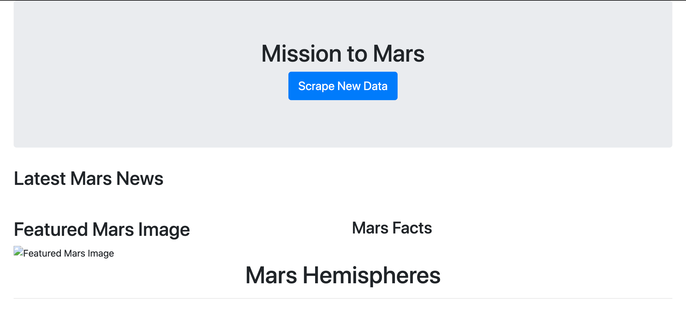
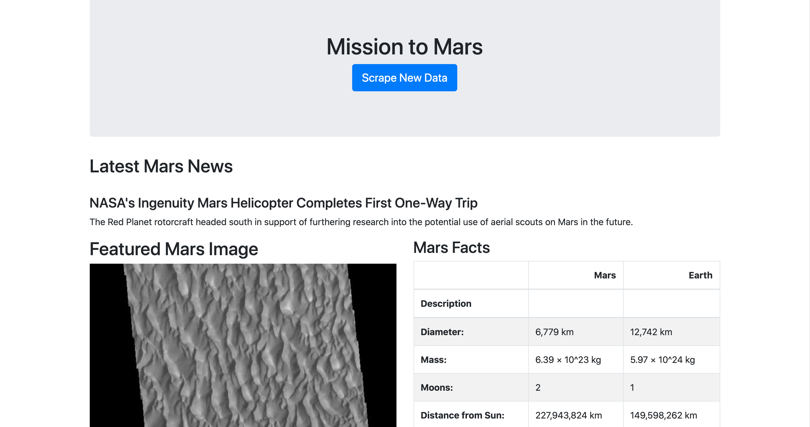
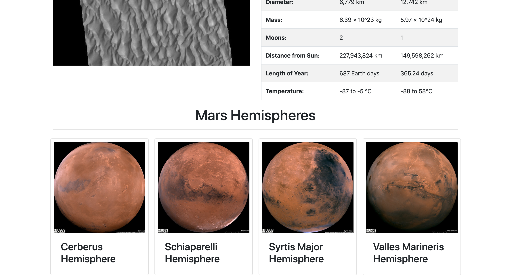
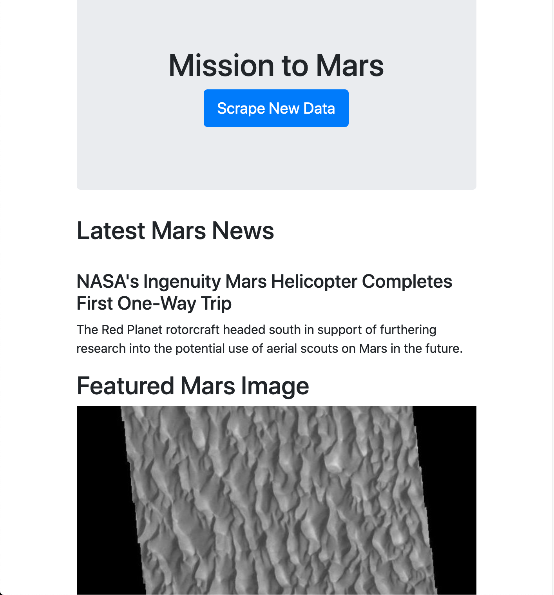
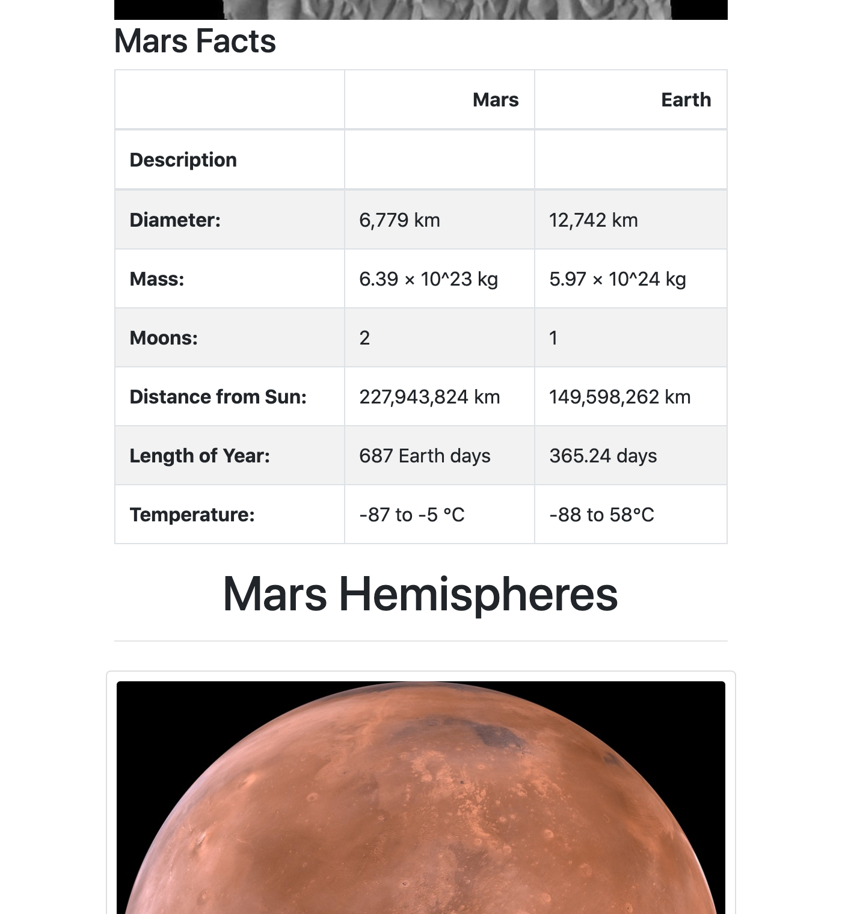

# web-scraping-challenge

## Mission to Mars

* This repo contains a Flask app that connects to a MongoDB database, and feeds data to about Mars to the frontend through an HTML template.
* The page includes a button that navigates to a flask route that runs a Python script that scrapes the web for new Mars. Our database is updated with the new info and is rendered to the screen.

### Tech used
* Python
* Jupyter Notebooks
* Pandas
* Beautiful Soup
* Splinter
* Flask
* MongoDB
* Pymongo
* Bootstrap 4

### Screenshots
* Before scraping the web and populating the database

* After scrape (wide-screen)

* After scrape (narrow-screen)

